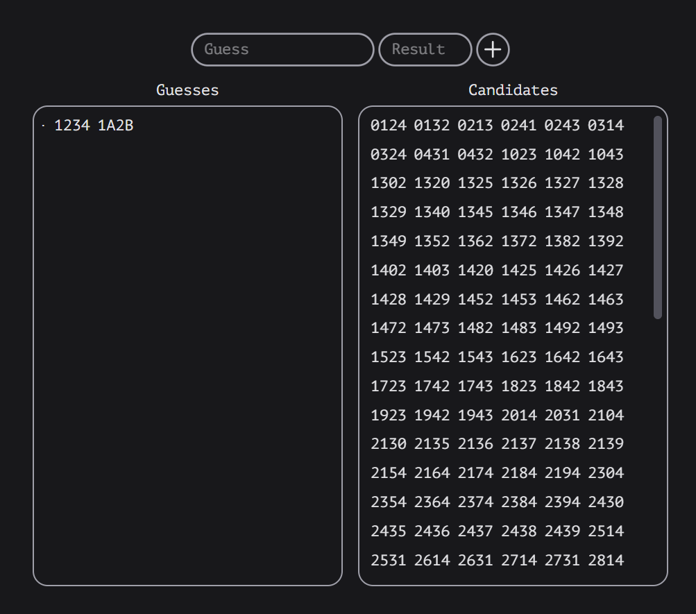

# Find1A2B

**Find1A2B** is a helper tool for the classic number guessing game **1A2B (Bulls and Cows)**.  
Instead of playing the game itself, this tool helps you **find the answer faster** by keeping track of your guesses and filtering out impossible candidates.

---

## How It Works

1. Enter your **guess** (e.g. `1234`) and the **result** you got from the game (e.g. `1A2B`).
2. Press the **"+" button** to submit.
3. The tool:
   - Records your guess & result on the left panel.
   - Updates the list of **possible candidates** on the right panel.
4. Keep entering new guesses and results until only one candidate remains — that’s the answer!

---

## Example

- Guess: `1234`  
- Result: `1A2B`  

The app will eliminate impossible numbers and show only those that could still be correct.

---

## Features

- Input guesses and results easily.  
- Automatically filter candidate numbers.  
- Clean, minimal dark-themed UI.  
- Helps you solve the puzzle instead of brute-forcing by hand.

---

## Screenshot

---

## Future Ideas

- Adjustable digit length (3, 4, or 5 digits).  
- Option for allowing/disallowing repeated digits.  
- Smart next-guess suggestions.  
- Export/share game progress.

---

## License

MIT License

ChatGPT wrote this README file, btw.